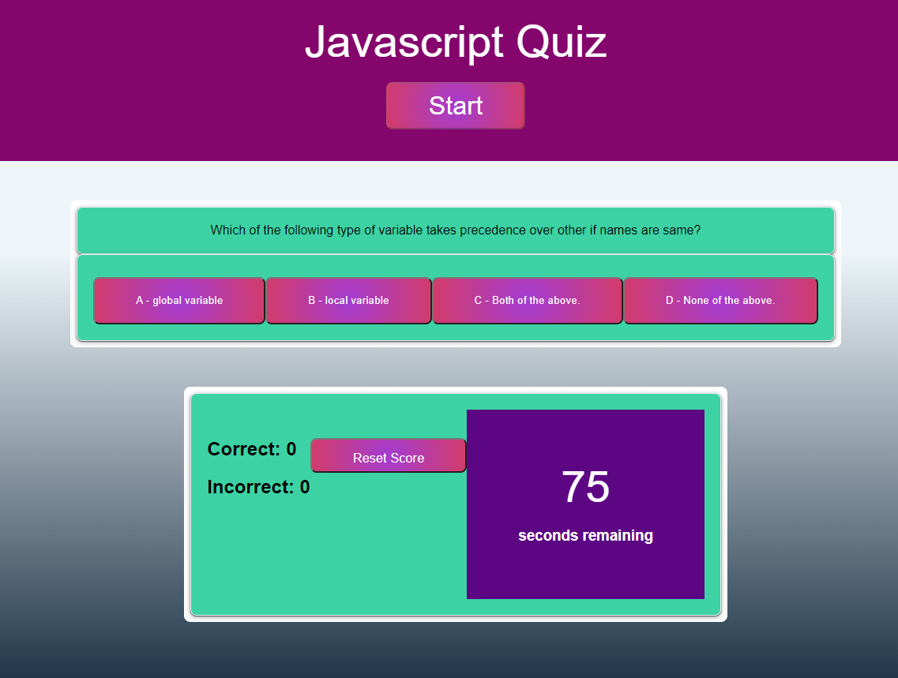

# Quiz-Time
## Table of Contents
- [General Info](#general-info)
- [Website](#website)
- [Screenshots](#screenshots)
- [Code](#code)
- [Status](#status)
- [Inspired By](#inspiration)
- [Contributers](#contributers)

## General Info
>A JavaScript Quiz with multiple choice questions, a timer, and high scores!

## Website 
> [Javascript Game Here!](https://laurenagra.github.io/Quiz-Time/)

## Screenshots

## Code
- HTML
- CSS
- Javascript

## Status
Project is complete as of Jan 26th, 2022

## Inspiration
- GA Tech Bootcamp Homework 4
- Mini Project 4

## Contributers 
- [Alex Harkins](https://github.com/amachkel)